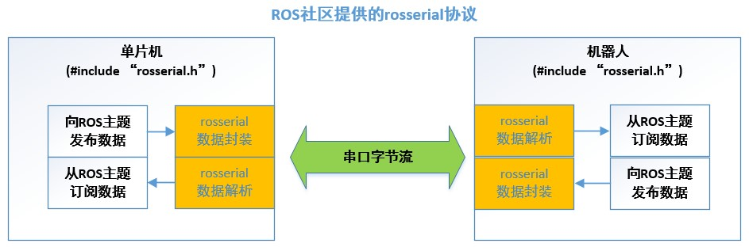
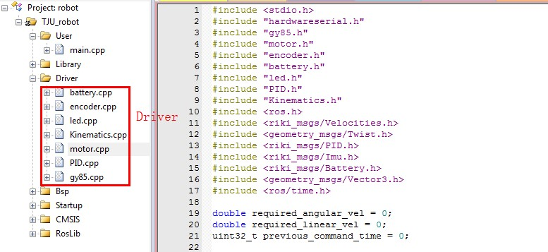
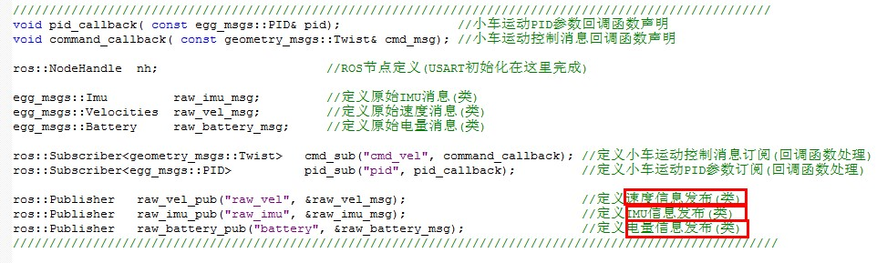
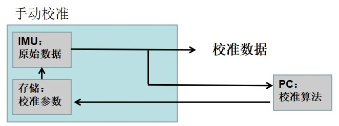
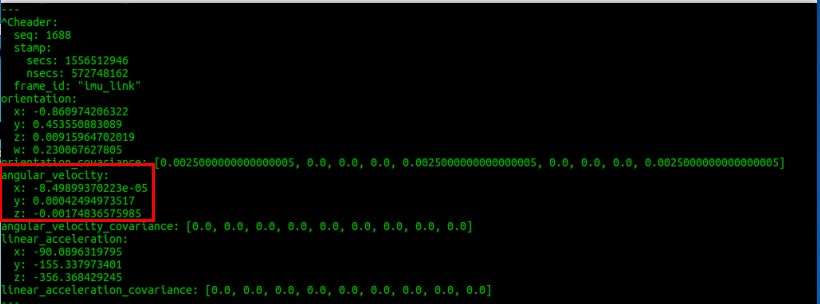
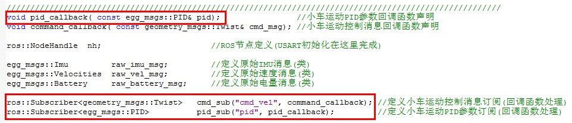
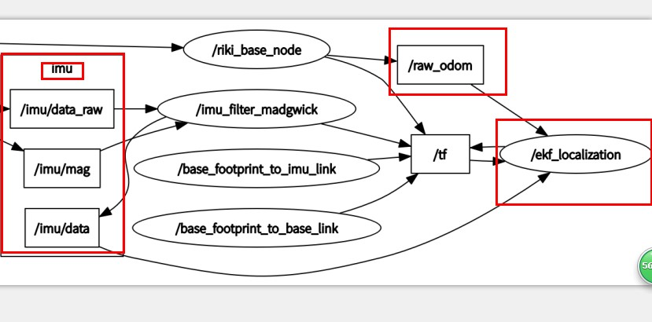

# IM-robot-embedded
-

## 一、通信协议改进方案：
由于直接使用，单片机-串口-ROS的通信方案，通常存在延迟，不稳定的状况，而且需要制定比较复杂的通信协议。本方案对此处进行改进，将底层的具体操作细节进行封装，这些细节被封装到ROS社区提供的基于串口通信的API中。ROS社区提供的rosserial库可以更加方便的解决单片机和机器人之间的通信问题，将传统的需要定义字节传输的方法，直接改为单片机和ROS之间直接通过ROS发布和订阅的话题进行数据传输。原理如图1。

图1 单片机和上位机之间的通信协议

在底层设计中，使用ROS社区提供的数据封装和数据解析思路，这样可以使在stm32上开发，达到在Ubuntu上开发的相同的数据传输思路。这样下位机的数据传输直接转换成在下位机直接发送话题和消息订阅的模式。上位机下ROS通信同上。中间的数据完全依靠ROS社区提供的通信库rosserial进行解析。

但是rosserial 只支持arduino 系列，而且协议虽然稳定但是过于臃肿，影响实时性，针对以上确定，重新对rosserial协议进行裁剪，从而在实际使用中实时性和稳定性进一步提高。解决了长时间单片机死机和数据传输实时性的问题。

图2 下位机程序框架

图3 在stm32上直接发送和订阅ROS数据格式

## 二、IMU 手动标定、角速度计算：

### 2.1 构建IMU误差模型
  
IMU误差主要来自三部分：噪声（bias and noise）、尺度误差（scale error）、轴偏差（axis misalignment）。通过对这些误差的补偿来实现IMU测量数据的校准。此处标定，考虑零偏Bias和高斯白噪声。Bias指内部构造等产生的噪声，高斯白噪声属于外部噪声，通常由AD转换造成。

其中，加速度a的原始测量值向量acc 加上零偏补偿Ba和白噪声Na补偿后，乘上尺度矫正矩阵Sa 和 偏差矫正矩阵Ta变换后，就得到校准后的三轴加速度向量acc_calib ；使用类似的方法可以获得三轴角速度和三轴磁力计mag_calib ；之后在进行坐标变换，把磁力计数据变换到加速度坐标系下，得到的数据作为加速度和磁力计的数据融合使用。在上位机直接进行校准，并将参数进行存储。校准基本流程如下图。

标定结果如下图所示，可以看到在x,y,z轴上的IMU初始值无限接近于0.

图4 手动标定

图5 IMU标定后的初始值

### 2.2  IMU传感器数据融合
由于加速度计和磁力计存在高频噪声，（需要低通滤波），信号会有很多“毛刺“，所以测得的瞬时值不够精确，解算出来的姿态会震荡，姿态方向是正确的。陀螺仪存在低频噪声（需要高通滤波），就是实时角速度计算比较精确，在进行积分就能得到旋转角度（姿态），但是积分会累积误差，后面的姿态会出现漂移现象。 加速度/磁力计和陀螺仪在频域上的特性互补，可以融合这三种传感器的数据，提高精度和系统的动态特性。

此处使用高低通滤波，主要分为估算、校正两个步骤：

* 估算：使用陀螺仪估算出t时刻四元数；

* 校正：通过加权系数融合陀螺仪估计姿态和加速度/磁力计融合姿态，达到对陀螺仪低通滤波、对加速度/磁力计高通滤波的效果。  

## 三、PID实时调试接口：

由于在Ubuntu 下进行PID 参数调试极为困难，此处在stm32上直接构造回调函数，并通过串口发布到上位机，在ubuntu下在写一个pid 对速度的补偿程序，以此实现PID 参数的实时调整，从而获得最佳控制参数。

图5 在stm32上构造回调函数

图6 在ubutnu 下实时对PID进行补偿

## 四、里程计和IMU数据融合
使用EKF算法对IMU和里程计数据进行融合

图7 imu数据和编码器的odom里程计数据进行融合

## 五、实验效果

4.1里程计的误差为，每两米直线运动误差在1-3cm ；每360度旋转，误差在3度左右。限制安全速度为1m/s以下 ,可从 0 – 2m/s 进行自动调速。